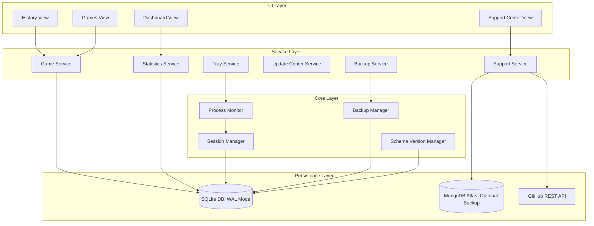
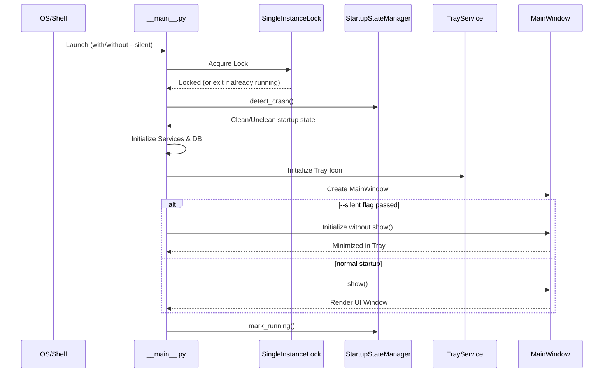
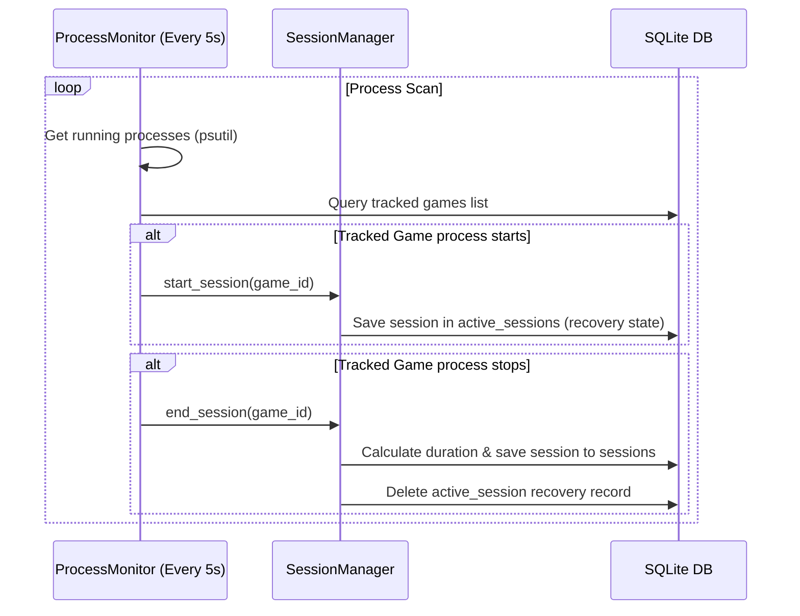
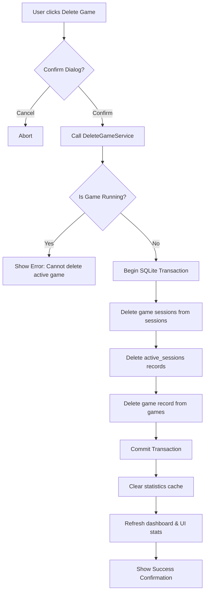
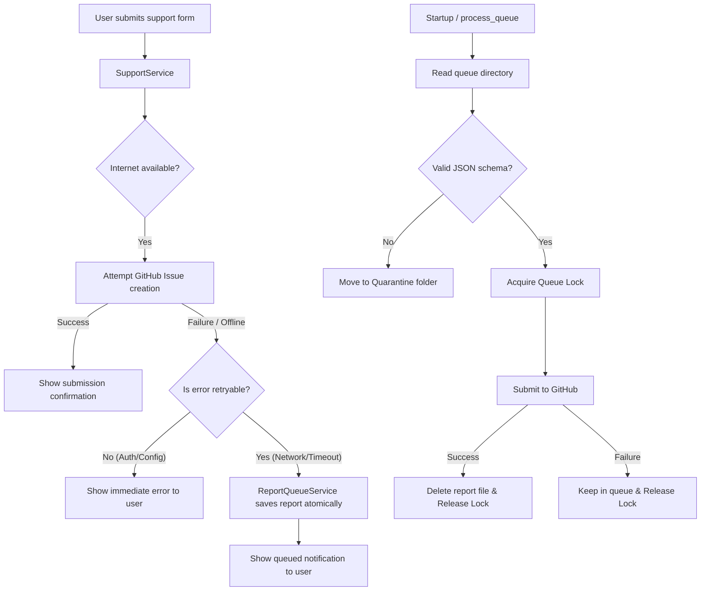
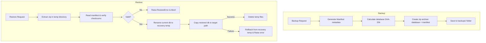
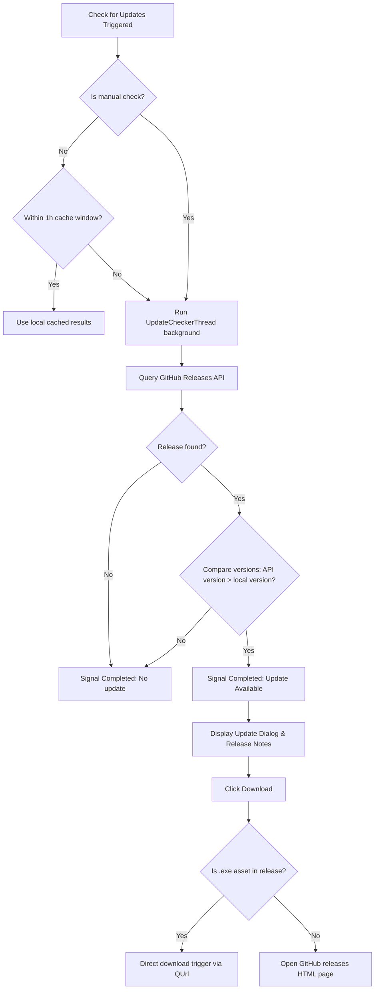

# Trackora Architecture Specification (v2.0.1)

This is the authoritative architectural reference for Trackora v2.0.1.

---

## 1. System Overview

Trackora is a modular monolith application designed to run locally on Windows systems. It runs silently in the system tray, scans for active processes, automatically detects when gaming sessions start and stop, and compiles detailed analytics. All data storage is local-first, respecting user privacy.

The system is structured around 7 distinct architectural layers:
1. **Tracking Layer**: Process scanning and session lifecycle tracking.
2. **Database Layer**: Local SQLite storage using the Repository pattern.
3. **Statistics Layer**: Real-time analytics, aggregations, and trends.
4. **UI Layer**: User interfaces, graphs, themes, and controller interactions.
5. **System Services Layer**: System tray integration, startup registration, notifications, and export utilities.
6. **Support Layer**: In-app feedback, bug reporting, update announcements, and queue management.
7. **Crash Detection Layer**: Startup monitoring, recovery, and unclean shutdown mitigation.

---

## 2. High-Level Architecture Diagram

---

## 3. Layer Responsibilities & Module Organization

### Core Packages & Module Map
- [tracker/](file:///E:/Code&Programs/GitHub/Trackora/tracker/)
  - `process_monitor.py`: Periodic process scanning.
  - `session_manager.py`: Session setup, active session lifecycle, duration computation.
  - `discovery/`: Core engine scanning Steam, Epic, Battle.net, EA, Ubisoft, and Riot.
- [database/](file:///E:/Code&Programs/GitHub/Trackora/database/)
  - `database_manager.py`: Connection lifecycle, WAL mode, transaction support.
  - `repositories/`: Contains `GamesRepository`, `SessionsRepository`, `SettingsRepository`, and `ActiveSessionsRepository`.
- [trackora_stats/](file:///E:/Code&Programs/GitHub/Trackora/trackora_stats/)
  - `statistics_service.py`: Computes historical playtime statistics.
  - `trend_analyzer.py`: Plays comparison and trends.
- [services/](file:///E:/Code&Programs/GitHub/Trackora/services/)
  - `tray_service.py`: System tray interactions and minimisation controls.
  - `startup_service.py`: Registers app on Windows login.
  - `export_service.py`: Data exportation in CSV and JSON formats.
  - `delete_game_service.py`: Safe, cascading deletions of games, sessions, and statistics.
  - `update_center_service.py`: Checks for updates, handles manual bypass, manages release downloading.
  - `cache_cleanup_service.py`: Manages in-memory cache expirations.
- [ui/](file:///E:/Code&Programs/GitHub/Trackora/ui/)
  - PyQt6 Model-View-Controller framework. Contains subdirectories for views and controllers.
- [models/support/](file:///E:/Code&Programs/GitHub/Trackora/models/support/)
  - Bug reports, feedback reports, and feature requests.
- [trackora/core/](file:///E:/Code&Programs/GitHub/Trackora/trackora/core/)
  - `backup_manager.py`: ZIP compression and manifest verification.
  - `schema_version_manager.py`: SQLite schema migrations.
  - `single_instance.py`: Mutex-based single instance locks.

---

## 4. Subsystem Pipelines

### A. Startup & Silent Startup Flow
When the application is launched, it verifies arguments, asserts its single-instance lock, and checks database schema alignment. If the `--silent` or `-s` flag is provided, it registers the tray icon but skips showing the main GUI window.

### B. Tracking Pipeline
The `ProcessMonitor` scans active running processes via `psutil` every 5 seconds. If a game's process is detected, `SessionManager` starts tracking a session. When the process disappears, the session is committed to SQLite.

### C. Delete Game Workflow
Deleting a game requires deleting its database record, all associated historical sessions, cleaning up statistics caches, and updating active trackers. The operation is transactional to prevent partial deletions.

### D. Support Subsystem & Retry Queue
The support subsystem submits user-friendly bug reports, feature requests, and general feedback. Submissions are sent to GitHub Issues. An optional write-only backup can be sent to a MongoDB Atlas cluster. When network errors occur, retryable reports are stored in an offline queue.

### E. Backup & Restore Lifecycle
Users can perform manual backups, and the system automatically backs up data before migrations. The backup is stored as a compressed ZIP file containing `trackora.db` and a metadata `manifest.json` containing the SHA-256 hash.

### F. Update Center
Update center queries are run off-thread via `UpdateCheckerThread` to prevent freezing the UI. Manual checks bypass the 1-hour caching cooldown. Releases are fetched from GitHub, version-compared using strict semver rules, and the download triggers direct installer setup files or falls back to the releases HTML page.

---

## 5. Security Model & Data Flow

- **Local-first**: Data remains stored locally in SQLite (`trackora.db`).
- **No Telemetry**: No background reporting or usage tracking.
- **Support Operations**: Support submissions to GitHub use user-provided Personal Access Tokens (classic). MongoDB reporting uses secure, parameterized connection strings.
- **Single Instance Mutex**: Uses Windows system mutexes to prevent concurrent SQLite access by multiple app instances.

---

## 6. Error Handling & Logging Architecture

Trackora features a centralized logging service structured at startup.
- **Log Location**: `%APPDATA%\Trackora\logs\trackora.log` using rotation.
- **Levels**: `INFO` for operational states, `WARNING` for transient failures (e.g. offline API checks, queued reports), and `ERROR` for serious concerns (crashes, DB corruptions).
- **Silent failure mitigation**: Subsystems catch fatal errors, write stack traces to log, and display descriptive error dialogs to users without crashing the application.

---

## 7. Performance Targets & Testing Summary

### Non-Functional Requirements (NFRs)
- **Idle CPU**: `0.00%` when minimized to system tray.
- **Active Scanning CPU**: `< 0.20%` average during process checks.
- **Memory Footprint**: `32 MB` (stabilized idle), `< 35 MB` under repeated navigation.
- **Startup Responsiveness**: Cold start `< 300 ms`, Warm start `< 150 ms`, Silent startup `< 20 ms` (no UI render).
- **Database Query Latency**: Composite dashboard loads in `< 10 ms`.
- **Upgrade/Migration Speed**: Full migration runs in `< 50 ms`.

### Testing Verification
Trackora is validated by a massive test harness containing **2,560 tests** covering regressions, version upgrades, installer logic, queue validator boundaries, and performance benchmarks. All 2,560 tests successfully pass.
