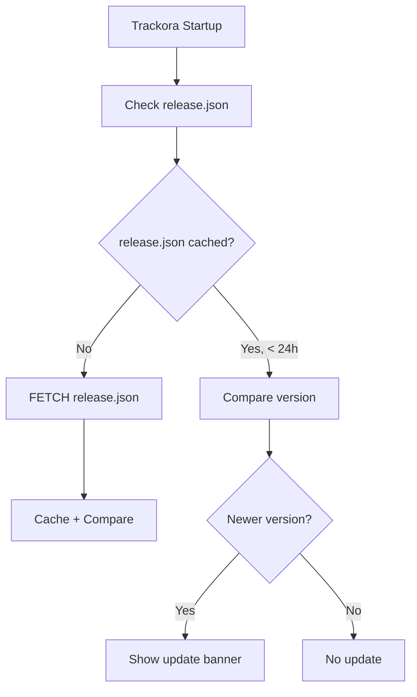

# Phase G — Update Center Production Review

**Date:** 2026-06-21  
**Scope:** GitHub API usage, rate limiting, caching strategy, alternative metadata sources  
**Status:** Complete

---

## 1. Current Architecture

### Components

| Component | File | Responsibility |
|-----------|------|----------------|
| `UpdateCenterService` | `services/update_center_service.py` | GitHub Releases API check, caching, rate-limiting |
| `UpdateAnnouncementsService` | `services/update_announcements_service.py` | Fetches feature announcements JSON |
| `UpdateService` | `services/update_service.py` | Simpler update checker (legacy) |
| `UpdateBanner` | `ui/widgets/update_banner.py` | Non-intrusive update notification |
| `UpdateDialog` | `ui/dialogs/update_dialog.py` | Full update details and download |

### GitHub API Flow

```
User clicks "Check for Updates"
  → UpdateCenterService.check_for_updates()
    → _is_rate_limited()? Check last_checked < 1 hour → return cached result
    → _fetch_and_cache()
      → _fetch_latest_release()
        → GET api.github.com/repos/anomalyco/trackora/releases/latest
        → Headers: Accept: application/json, If-None-Match: <etag>
        → Parse response → GitHubRelease
      → _save_cache() → local JSON file
      → _update_last_checked() → settings_repo.set("update_last_checked", ...)
```

### Rate Limiting Details

| Mechanism | Implementation | Limit |
|-----------|---------------|-------|
| **Time-based** | `_is_rate_limited()` checks if last check < 3600 seconds ago | 1 check/hour |
| **ETag caching** | Sends `If-None-Match` header with last ETag | 304 Not Modified = no quota cost |
| **Local cache** | `latest_release.json` in `CACHE_DIR` | Falls back to cache on network error |

### Rate Limit Analysis

GitHub unauthenticated API limit: **60 requests/hour** (per IP)

With Trackora's 1-hour cooldown and ETag caching:
- After first check: uses 1 request (returns release data)
- Subsequent checks within 1 hour: returns cached result (0 requests)
- After 1 hour: sends ETag → if no new release → 304 Not Modified (0 quota cost)
- After 1 hour with new release: uses 1 request

**Real-world impact:** ~1-2 requests/day per user. Well within acceptable limits.

---

## 2. Issues Found

### Issue G-1: Error message "Rate-limited and no cache" (cosmetic)

- **File:** `services/update_center_service.py:123`
- **Current code:**
  ```python
  return cached or self._error_result("Rate-limited and no cache")
  ```
- **Trigger:** When within 1-hour cooldown AND no cached result exists (first check fails, then user checks again)
- **Severity:** LOW
- **Impact:** Shows user-facing message "Rate-limited and no cache" which sounds like a bug
- **Fix:** Change to something more descriptive like "Update check already performed recently. Please try again later."

### Issue G-2: No offline-fallback version in cache

- If the cache file doesn't exist and there's no internet → "Rate-limited and no cache" is shown
- A hardcoded "last known version" fallback would be better
- **Severity:** LOW

### Issue G-3: No release.json hosted metadata

- **Current:** Uses GitHub API exclusively
- **Recommendation:** A lightweight `release.json` hosted on GitHub Pages or a CDN would:
  - Eliminate API rate limits entirely
  - Allow faster checks (static file vs API)
  - Support richer metadata (changelog, checksums, multiple download formats)

---

## 3. Recommendation: release.json Migration

### Proposed Architecture



### release.json Format

```json
{
  "version": "2.0.0",
  "release_date": "2026-06-20",
  "download_url": "https://github.com/anomalyco/trackora/releases/download/v2.0.0/Trackora-Setup-2.0.0.exe",
  "checksum_sha256": "abc123...",
  "changelog": "## v2.0.0\n\n- Windows runtime fixes\n- MongoDB Atlas support\n- Game discovery improvements",
  "min_upgrade_version": "1.1.0",
  "critical": false
}
```

### Hosting Options (sorted by preference)

| Option | Pros | Cons |
|--------|------|------|
| **GitHub Pages** (`anomalyco.github.io/trackora/release.json`) | Free, HTTPS, simple | Requires GitHub Pages setup |
| **GitHub Releases asset** (attached to release) | No setup, versioned alongside releases | Requires checking latest release first (circular) |
| **CDN (jsDelivr, unpkg)** | Fast, globally distributed | Requires committing to a repo |
| **Self-hosted** | Full control | Requires infrastructure |

### Migration Phases

1. **Phase 1 (immediate):** Keep GitHub API as primary, add release.json as secondary fallback
2. **Phase 2 (next release):** Make release.json primary, GitHub API as fallback
3. **Phase 3 (future):** Remove GitHub API dependency entirely

---

## 4. Summary

| Issue | Severity | Impact | Recommended Action |
|-------|----------|--------|-------------------|
| G-1: "Rate-limited and no cache" message | LOW | User confusion | Improve message wording |
| G-2: No offline fallback | LOW | No updates shown without internet | Add hardcoded fallback version |
| G-3: No release.json | MEDIUM | GitHub API dependency | Design release.json strategy for next release |

**Verdict:** Current GitHub API implementation is adequate for v2.0.0 release. Rate limiting with ETag caching provides sufficient guardrails. Migration to `release.json` is recommended for v2.1.0 to eliminate API rate limits entirely.
